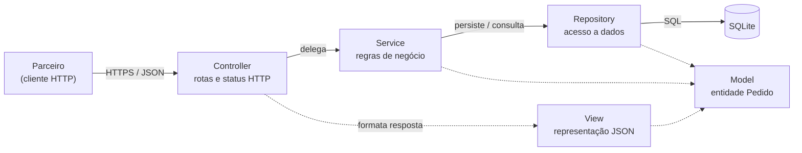
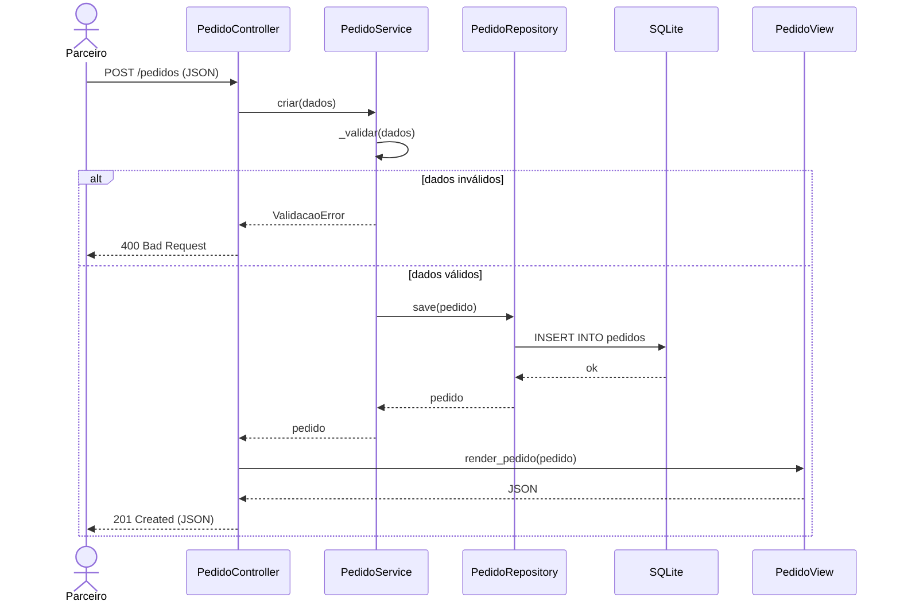
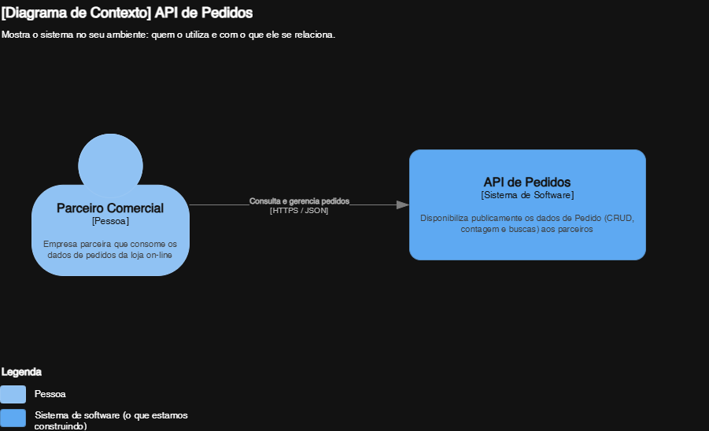
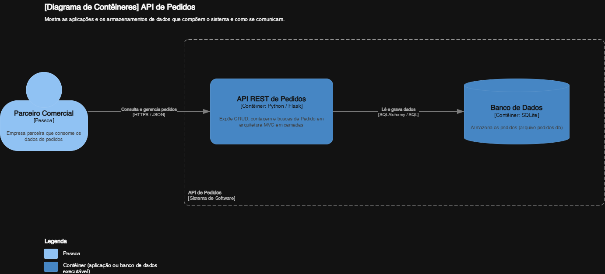
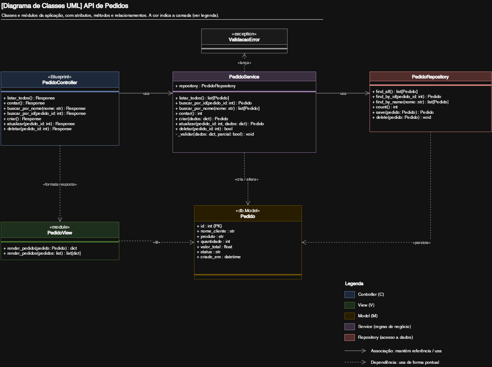

# API REST de Pedidos — Flask + MVC


**Desafio Final — Bootcamp Arquiteto(a) de Software (Pós-graduação, AST267A)**
Autor: Nicolas Begnini Leite

---

## Sumário

1. [Contexto do desafio](#1-contexto-do-desafio)
2. [Tecnologias](#2-tecnologias)
3. [Arquitetura](#3-arquitetura)
4. [Diagramas](#4-diagramas)
5. [Estrutura de pastas](#5-estrutura-de-pastas)
6. [Modelo de dados](#6-modelo-de-dados)
7. [Endpoints da API](#7-endpoints-da-api)
8. [Como executar](#8-como-executar)
9. [Exemplos de uso](#9-exemplos-de-uso)
10. [Decisões arquiteturais](#10-decisões-arquiteturais)
11. [Limitações conhecidas e evolução](#11-limitações-conhecidas-e-evolução)
12. [Mapa de entregáveis do desafio](#12-mapa-de-entregáveis-do-desafio)

---

## 1. Contexto do desafio

Uma grande empresa de vendas on-line precisa disponibilizar **publicamente** os dados de **Pedido** aos seus parceiros. Como arquiteto de software, a solução projetada, documentada e implementada é uma **API REST**, organizada no padrão arquitetural **MVC**, que expõe:

- **CRUD** completo de pedidos (criar, ler, atualizar e excluir);
- **Contagem** total de registros;
- **Find All** (listar todos);
- **Find By ID** (buscar por identificador);
- **Find By Name** (buscar pelo nome do cliente).

A persistência dos dados foi implementada (diferencial previsto no enunciado) com **SQLite** e **SQLAlchemy**.

## 2. Tecnologias

| Tecnologia | Uso |
|---|---|
| Python 3.10+ | Linguagem |
| Flask 3.1 | Framework web / API REST |
| Flask-SQLAlchemy 3.1 | ORM e integração com o banco |
| SQLite | Banco de dados relacional (arquivo local, sem instalação) |
| OpenAPI 3.0 + Swagger UI | Contrato e documentação interativa da API |
| draw.io | Diagramas C4 e UML |

## 3. Arquitetura

A solução adota uma **arquitetura em camadas** com o padrão **MVC** na porta de entrada. Como a aplicação é uma API (não há telas HTML), a **View** é a **representação JSON** do recurso devolvida ao cliente. As regras de negócio e o acesso a dados ficam em camadas próprias (**Service** e **Repository**), para manter cada componente com uma única responsabilidade.



### Papel de cada camada

| Camada | Papel no MVC | Responsabilidade |
|---|---|---|
| **Model** | M | Entidade de domínio `Pedido` e seu mapeamento para a tabela `pedidos`. |
| **View** | V | Define como o `Pedido` é apresentado ao consumidor da API (JSON). |
| **Controller** | C | Expõe os endpoints, lê a requisição HTTP, chama o Service e devolve o status code correto. **Não contém regra de negócio.** |
| **Service** | Negócio | Validações e regras (quantidade > 0, status válido etc.). Não conhece HTTP nem SQL. |
| **Repository** | Dados | Único ponto de acesso ao banco. Isola a tecnologia de persistência do restante do código. |

### Regra de dependência

```
Controller  →  Service  →  Repository  →  Model
```

As dependências apontam sempre em um único sentido. O Controller nunca acessa o banco diretamente, e o Repository não conhece HTTP. Com isso, trocar o banco de dados afeta somente o Repository, e trocar o formato de resposta afeta somente a View.

### Padrões de projeto aplicados

| Padrão | Onde | Benefício |
|---|---|---|
| **MVC** | Estrutura geral | Separação entre dados, apresentação e controle. |
| **Repository** | `repositories/` | Desacopla o domínio da tecnologia de persistência. |
| **Service Layer** | `services/` | Centraliza as regras de negócio. |
| **Dependency Injection** | `PedidoService(repository=...)` | Permite substituir o repositório sem alterar o Service. |
| **Application Factory** | `create_app()` | Cria a aplicação a partir de uma configuração, facilitando a troca de ambiente. |
| **Blueprint** | `pedido_bp` | Modulariza as rotas por recurso. |

### Requisitos arquiteturais atendidos

| Atributo de qualidade | Como é atendido |
|---|---|
| Manutenibilidade | Camadas coesas, com responsabilidades isoladas. |
| Testabilidade | Application Factory e injeção de dependência permitem isolar e substituir componentes. |
| Modificabilidade | Troca de banco restrita ao Repository. |
| Interoperabilidade | REST + JSON, padrão aberto consumível por qualquer parceiro. |
| Escalabilidade | API *stateless*, permitindo várias instâncias atrás de um balanceador. |

### Fluxo de uma requisição (`POST /pedidos`)



## 4. Diagramas

Os diagramas foram elaborados no **draw.io** seguindo o **modelo C4**. O arquivo-fonte editável está em [`docs/Arq_AST267A_DesFinal_NicolasBegniniLeite.drawio`](docs/Arq_AST267A_DesFinal_NicolasBegniniLeite.drawio).

### C4 — Nível 1: Contexto


### C4 — Nível 2: Contêineres


### C4 — Nível 3: Componentes


### UML — Diagrama de classes


## 5. Estrutura de pastas

```
.
├── app/
│   ├── __init__.py                  # Application Factory (create_app)
│   ├── config.py                    # Configurações por ambiente
│   ├── extensions.py                # Instância do banco (db)
│   ├── swagger.py                   # Registro do Swagger UI e do contrato OpenAPI
│   ├── openapi/
│   │   └── openapi.yaml             # Contrato OpenAPI 3.0 da API
│   ├── models/
│   │   └── pedido.py                # Model: entidade Pedido
│   ├── views/
│   │   └── pedido_view.py           # View: representação JSON
│   ├── controllers/
│   │   └── pedido_controller.py     # Controller: endpoints REST
│   ├── services/
│   │   └── pedido_service.py        # Regras de negócio e validações
│   └── repositories/
│       └── pedido_repository.py     # Acesso ao banco de dados
├── docs/                            # Diagramas (C4/UML) e documentação
├── run.py                           # Ponto de entrada da aplicação
├── requirements.txt                 # Dependências
├── .gitignore
└── README.md
```

| Arquivo / pasta | Função |
|---|---|
| `models/pedido.py` | Define os atributos do Pedido e o mapeamento para a tabela. |
| `views/pedido_view.py` | Converte o objeto `Pedido` em dicionário/JSON. |
| `controllers/pedido_controller.py` | Mapeia URLs e verbos HTTP para as operações do Service. |
| `services/pedido_service.py` | Valida dados e executa as regras do negócio. |
| `repositories/pedido_repository.py` | Executa consultas e gravações no banco. |
| `config.py` | Concentra as configurações (URI do banco de dados). |
| `extensions.py` | Evita importações circulares ao criar o `db` fora da factory. |
| `swagger.py` | Publica a interface Swagger UI (`/docs`) e o contrato (`/openapi.yaml`). Isolado dos controllers. |
| `openapi/openapi.yaml` | Contrato da API: endpoints, parâmetros, schemas e códigos de resposta. |
| `run.py` | Inicia o servidor (equivalente à classe `ApiApplication` do Spring). |

## 6. Modelo de dados

Tabela `pedidos`:

| Campo | Tipo | Regras |
|---|---|---|
| `id` | Inteiro | Chave primária, gerada automaticamente |
| `nome_cliente` | Texto (até 120) | Obrigatório, não vazio, indexado |
| `produto` | Texto (até 120) | Obrigatório, não vazio |
| `quantidade` | Inteiro | Obrigatório, maior que zero |
| `valor_total` | Número | Obrigatório, maior ou igual a zero |
| `status` | Texto | `CRIADO` (padrão), `PAGO`, `ENVIADO`, `ENTREGUE` ou `CANCELADO` |
| `criado_em` | Data/hora (UTC) | Preenchido automaticamente |

## 7. Endpoints da API

URL base: `http://127.0.0.1:5000`

### Documentação interativa (Swagger UI)

Com a API em execução, acesse **http://127.0.0.1:5000/docs**. A página lista todos os endpoints e permite testá-los pelo navegador: abra um endpoint, clique em **Try it out**, preencha os campos e clique em **Execute**.

| Recurso | URL |
|---|---|
| Swagger UI (interface interativa) | `/docs` (a raiz `/` redireciona para cá) |
| Contrato OpenAPI 3.0 (YAML) | `/openapi.yaml` |

O contrato pode ser importado em ferramentas como Postman, Insomnia ou geradores de cliente/SDK.

### Resumo dos endpoints

| Operação | Método | Rota | Sucesso | Erros |
|---|---|---|---|---|
| Create | `POST` | `/pedidos` | `201 Created` | `400` |
| Find All | `GET` | `/pedidos` | `200 OK` | — |
| Contagem | `GET` | `/pedidos/contar` | `200 OK` | — |
| Find By ID | `GET` | `/pedidos/{id}` | `200 OK` | `404` |
| Find By Name | `GET` | `/pedidos/nome/{nome}` | `200 OK` | — |
| Update | `PUT` | `/pedidos/{id}` | `200 OK` | `400`, `404` |
| Delete | `DELETE` | `/pedidos/{id}` | `204 No Content` | `404` |

**Observações:**

- A busca por nome é **parcial**: `/pedidos/nome/mar` encontra "Maria Silva". Sem resultados, retorna lista vazia (`[]`) com `200`. Para caracteres acentuados, o SQLite diferencia maiúsculas de minúsculas.
- O `PUT` funciona como **atualização parcial**: apenas os campos enviados são alterados.
- Erros seguem o formato `{"erro": "mensagem descritiva"}`.

### Exemplo de corpo (`POST /pedidos`)

```json
{
  "nome_cliente": "Maria Silva",
  "produto": "Notebook",
  "quantidade": 1,
  "valor_total": 4500.0
}
```

### Exemplo de resposta (`201 Created`)

```json
{
  "id": 1,
  "nome_cliente": "Maria Silva",
  "produto": "Notebook",
  "quantidade": 1,
  "valor_total": 4500.0,
  "status": "CRIADO",
  "criado_em": "2026-09-21T03:01:39.037756"
}
```

## 8. Como executar

**Pré-requisito:** Python 3.10 ou superior.

### Windows (PowerShell)

```powershell
git clone https://github.com/NicolasBegnini/Desafio-Final---POS-AST267A---Nicolas-Begnini-Leite.git
cd Desafio-Final---POS-AST267A---Nicolas-Begnini-Leite

python -m venv .venv
.venv\Scripts\activate
python -m pip install -r requirements.txt

python run.py
```

> Se o PowerShell bloquear a ativação do ambiente virtual, execute uma vez:
> `Set-ExecutionPolicy -Scope CurrentUser RemoteSigned`

### Linux / macOS

```bash
git clone https://github.com/NicolasBegnini/Desafio-Final---POS-AST267A---Nicolas-Begnini-Leite.git
cd Desafio-Final---POS-AST267A---Nicolas-Begnini-Leite

python3 -m venv .venv
source .venv/bin/activate
python -m pip install -r requirements.txt

python run.py
```

A API sobe em **http://127.0.0.1:5000**. A documentação interativa (Swagger) fica em **http://127.0.0.1:5000/docs**. Na primeira execução o arquivo de banco `pedidos.db` é criado automaticamente. Para usar outro banco, defina a variável de ambiente `DATABASE_URL`.

## 9. Exemplos de uso

O caminho mais simples é o **Swagger UI** (`/docs`). Os exemplos abaixo mostram as mesmas chamadas por linha de comando.

### PowerShell (Windows)

```powershell
# Create
$body = @{ nome_cliente = "Maria Silva"; produto = "Notebook"; quantidade = 1; valor_total = 4500 } | ConvertTo-Json
Invoke-RestMethod -Method Post -Uri http://127.0.0.1:5000/pedidos -Body $body -ContentType "application/json"

# Find All
Invoke-RestMethod http://127.0.0.1:5000/pedidos

# Find By ID
Invoke-RestMethod http://127.0.0.1:5000/pedidos/1

# Find By Name
Invoke-RestMethod http://127.0.0.1:5000/pedidos/nome/maria

# Contagem
Invoke-RestMethod http://127.0.0.1:5000/pedidos/contar

# Update
$upd = @{ status = "PAGO" } | ConvertTo-Json
Invoke-RestMethod -Method Put -Uri http://127.0.0.1:5000/pedidos/1 -Body $upd -ContentType "application/json"

# Delete
Invoke-RestMethod -Method Delete -Uri http://127.0.0.1:5000/pedidos/1
```

### curl (Linux / macOS / Git Bash)

```bash
curl -X POST http://127.0.0.1:5000/pedidos \
  -H "Content-Type: application/json" \
  -d '{"nome_cliente":"Maria Silva","produto":"Notebook","quantidade":1,"valor_total":4500}'

curl http://127.0.0.1:5000/pedidos
curl http://127.0.0.1:5000/pedidos/1
curl http://127.0.0.1:5000/pedidos/nome/maria
curl http://127.0.0.1:5000/pedidos/contar
curl -X PUT http://127.0.0.1:5000/pedidos/1 -H "Content-Type: application/json" -d '{"status":"PAGO"}'
curl -X DELETE http://127.0.0.1:5000/pedidos/1
```

> No PowerShell, `curl` é um apelido de `Invoke-WebRequest` e não aceita essas opções. Use os exemplos com `Invoke-RestMethod` acima ou chame `curl.exe` explicitamente.

## 10. Decisões arquiteturais

| Decisão | Motivo | Trade-off |
|---|---|---|
| **Flask** | Leve e direto; adequado a uma API de escopo pequeno. | Menos recursos prontos que frameworks maiores (ex.: Django). |
| **Camada Service** | Mantém o Controller livre de regra de negócio e favorece o reuso. | Mais arquivos para um CRUD simples. |
| **Repository Pattern** | Isola a tecnologia de persistência. | Uma camada adicional de indireção. |
| **View como JSON** | Não expõe o Model diretamente e permite evoluir o contrato da API sem alterar o domínio. | Código extra de serialização. |
| **SQLite** | Zero configuração e persistência real para o desafio. | Não recomendado para alta concorrência; em produção, usar PostgreSQL ou similar. |
| **Application Factory** | Configuração por ambiente. | Exige registrar componentes dentro da função. |
| **OpenAPI + Swagger UI** (contrato em `openapi.yaml`, fora dos controllers) | Documentação interativa e padronizada; mantém os controllers limpos; contrato reutilizável em outras ferramentas. | O YAML é mantido manualmente e pode divergir do código se não for atualizado junto com os endpoints. |
| **Códigos HTTP semânticos** | `201`, `204`, `400` e `404` comunicam o resultado de forma padronizada. | — |

## 11. Limitações conhecidas e evolução

Esta é uma implementação voltada ao desafio acadêmico. Para uso em produção, os próximos passos recomendados seriam:

- **Autenticação e autorização** (API Key ou OAuth2/JWT), já que a API é exposta a parceiros externos;
- **Paginação** e filtros na listagem, para volumes grandes de dados;
- **Banco de dados de produção** (PostgreSQL) e **migrações** com Alembic;
- **Servidor WSGI** (Gunicorn ou Waitress) no lugar do servidor de desenvolvimento do Flask — o `run.py` usa `debug=True`, adequado apenas para ambiente local;
- **Conteinerização** com Docker e pipeline de **CI**;
- **Rate limiting** e **logs estruturados** para observabilidade e proteção da API.

## 12. Mapa de entregáveis do desafio

| # | Entregável | Onde encontrar |
|---|---|---|
| 1 | Arquitetura do software (C4 / UML / draw.io) | Seção [4](#4-diagramas) e pasta `docs/` |
| 2 | Estrutura de pastas do projeto MVC | Seção [5](#5-estrutura-de-pastas) |
| 3 | Explicação da estrutura e dos elementos | Seções [3](#3-arquitetura) e [5](#5-estrutura-de-pastas) |
| 4 | *(Opcional)* Código funcionando | Este repositório — seção [8](#8-como-executar) |
| 5 | *(Opcional)* Persistência funcionando | SQLite + SQLAlchemy — seção [6](#6-modelo-de-dados) |

---

**Autor:** Nicolas Begnini Leite
**Curso:** Pós-graduação — Bootcamp Arquiteto(a) de Software (AST267A)